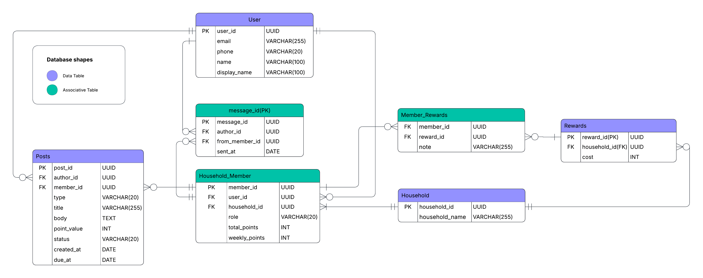

# Corkboard 

A household management app for families and roommates built to run on Android. With an emphasis on ease of use and intuitive controls, it centralizes tasks, chores and notes into a shared household board. Analogous to the real life inspiration, the emphasis on ease of use allows for those of limited technical experience to successfully interact with the app. A virtual alternative in a world that is rapidly adopting screens in communal areas.

With a built in household messaging system, households can stay connected in one centralized application. Completing chores earns points that can be redeemed in a rewards shop, promoting engagement and allowing for custom incentives for members of the household.

---

## Tech Stack

- **Android**: Kotlin, Jetpack Compose, MVVM
- **Backend**: Supabase (PostgreSQL, PostgREST, Auth)
- **Security**: Row Level Security (RLS) enforced at the database level
- **CI/CD**: GitHub Actions

---

## Architecture

The app follows a standard MVVM pattern:

- **UI Layer**: Jetpack Compose screens observe state via `StateFlow`
- **ViewModel Layer**: Handles business logic and exposes state to the UI
- **Repository Layer**: Isolated Supabase calls. One repository per domain
- **Supabase**: Authentication via JWT, data access via REST + PostgREST, Row Level Security ensures users can only access households they belong to

---

## Database Schema

Key relationships:
- A **User** can belong to multiple **Households** through **HouseholdMember**, which also tracks their role (admin/member) and points
- **Posts** belong to a Household and can be notes or chores
- **Rewards** belong to a Household and are tracked per member through **MemberRewards**

---

## Features

### Board
- Create, edit, and delete notes and chores
- Complete chores to earn points
- Filter posts by household
- Customize posts, completion stickers using rewards earned from the shop

### Shop
- Spend points to unlock rewards (post themes, completion stickers)
- Ownership is tracked per household member

### Household Management
- Create and join households
- Add and remove members by email
- Admin role with elevated permissions (delete any post, edit member points)
- Rename households

### Profile & Account
- Update display name, email, and password
- View your households and membership details

### Messaging
- Messaging between household members

---

## CI/CD

GitHub Actions runs on every pull request to `main`:

1. **Unit tests**: ViewModel state logic for post CRUD operations (MockK + coroutines-test)
2. **Debug APK build**: Verifies the app compiles cleanly
3. **PLANNED - APK artifact**: Uploaded to the workflow run for download

---

## Installation

1. Download the APK from the latest [GitHub Actions](https://github.com/paxleslie/capstone/actions) run under **Artifacts**
2. On your Android device, enable **Install from unknown sources** (Settings → Security)
3. Open the downloaded APK and install
4. Sign up or log in to get started

---

## Team

Thomas Bakaysa, Pax Leslie, Scotty Roberts, Brandon Sanchez, Chyler Jones
